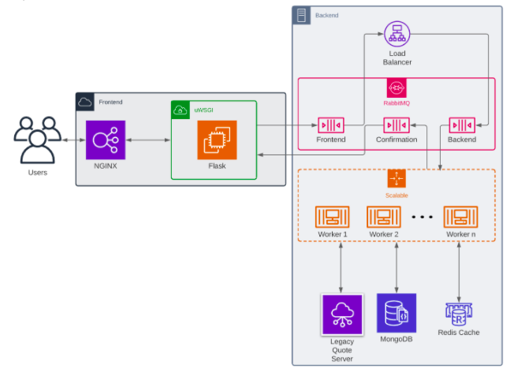

# CSC468-group3 Pygang
Group project for SENG 468 at the University of Victoria

## Team Members
Rory Smith

Oliver Lewis

Janhavi Dudhat

## Project Info
This is an end-to-end solution to support day trading activities. 
The user is expected to perform the following trading and account management activities:
- View their account
- Add money to their account
- Get a stock quote
Buy a number of shares in a stock
- Sell a number of shares in a stock they own
- Set an automated sell point for a stock
- Set a automated but point for a stock
- Review their complete list of transactions
- Cancel a specified transaction prior to its being committed
- Commit a transaction

## Architecture
Scalability was the main focus when designing the following system architecture.

The system has separate containers to handle HTTP requests from the clients and a backend transaction server to handle the commands.

NGINX acts as a reverse server proxy and load balancer. This is a standard design decision for many servers and allows for great scalability, especially if upgraded to the premium version. For our uses however, the free version provides sufficient scalability as it's unlikely the system will need more than one container to handle HTTP requests. uWSGI was chosen to manage the flask application as it is widely used, especially when paired with NGINX. Since Flask is a very lightweight application framework, these managing frameworks are needed to provide any level of scalability and security for the front end.

Interacting with the database and the legacy quote server (the quote server provides price values for the stocks) takes time and the requirement that each user's commands are executed synchronously remove many possibilities for concurrency within one process without complex data management for many users. To solve this scaling issue, multiple containers, which can independently handle requests can be spun up as needed by the manager container. The manager handles load balancing, docker handling, and reading of the workload files. 

Frameworks such as Kubernetes could replace the custom manager container but configuring Kubernetes for our specific use case is thought to be more difficult than building a custom load balancer from scratch. 

Each worker container can access the Legacy Server and the MongoDB database at any time and it's up to each to handle this concurrency. A Redis cache is added to minimize hits to the quote server and to speed up user verification.
 
> To run the system, refer to the instructions listed 
[here.](./documentation)
